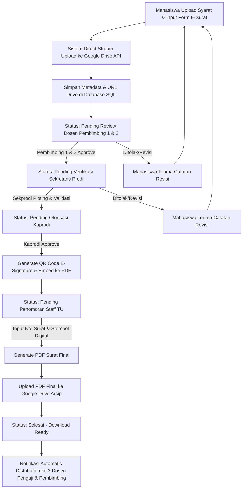

# Product Requirement Document (PRD)
## Sistem E-Surat Administrasi Tugas Akhir (Prodi Teknik Informatika)

> **Versi Document:** 1.0  
> **Status:** Draft Proposal / Blueprint Architecture  
> **Tanggal:** 25 Juli 2026  
> **Target Platform:** Web-Based Application (Responsive Desktop & Mobile)  

---

## 1. Pendahuluan & Latar Belakang

Program Studi Teknik Informatika memerlukan sistem tata kelola administrasi dokumen Tugas Akhir (TA) / Skripsi yang efisien, transparan, dan terstruktur. Proses administrasi manual sering kali menghadapi kendala seperti:
- Keterlambatan verifikasi dan tanda tangan fisik oleh Dosen / Kaprodi.
- Kesulitan pelacakan posisi surat (*tracking disposisi*).
- Risiko kehilangan dokumen syarat seminar/sidang.
- Keterbatasan ruang penyimpanan server lokal untuk berkas-berkas lampiran berukuran besar (PDF draft skripsi, program, dokumen pendukung).

**Sistem E-Surat Tugas Akhir** hadir sebagai solusi berbasis web modular berbasis **MVC (Model-View-Controller)** yang mengintegrasikan **Database SQL** untuk transaksi data relational dan **Google Drive API** untuk enkapsulasi penyimpanan berkas cloud secara otomatis, rapi, dan terstruktur.

---

## 2. Tujuan & Sasaran Sistem (Goals & Objectives)

1. **Digitalisasi Administrasi 100%:** Mengotomatiskan pembuatan, pengajuan, persetujuan (approval), dan penomoran surat administrasi TA.
2. **Integrasi Google Drive Cloud Storage:** Menyimpan dokumen pendukung dan arsip PDF secara otomatis ke folder hirarki Google Drive prodi.
3. **Tracking Transparan Real-Time:** Memungkinkan mahasiswa memantau status pengajuan surat secara langsung (Timeline & Status Badge).
4. **Keamanan & Keabsahan Dokumen:** Menerapkan E-Signature (Tanda Tangan Digital) berbasis QR Code yang memuat hash verifikasi kriptografi.
5. **Arsitektur Modular & Scalable:** Memisahkan lapisan data (Model), tampilan (View), logika bisnis (Controller), serta integrasi pihak ketiga (Drive Service Layer).

---

## 3. Matriks Peran Pengguna (User Roles & Access Control Matrix)

| Peran (Role) | Hak Akses & Tanggung Jawab utama |
| :--- | :--- |
| **Mahasiswa** | - Mengajukan Surat Pengantar Riset, Permohonan Pembimbing, Undangan Sempro/Sidang, Bebas Masalah TA.<br>- Upload berkas syarat ke Google Drive via system.<br>- Monitoring status disposisi surat & download surat final. |
| **Sekretaris Prodi (Sekprodi)** | - Validasi awal kelengkapan berkas administrasi TA.<br>- Ploting 2 Dosen Pembimbing & 3 Dosen Penguji.<br>- Penjadwalan Seminar Proposal & Sidang Munaqasyah. |
| **Kaprodi** | - Otorisasi tingkat akhir (Approval SK Pembimbing & Surat Tugas Resmi).<br>- Tanda Tangan Digital (E-Signature) via QR Code Kriptografi. |
| **Staff TU (Tata Usaha)** | - Penerbitan Nomor Surat Resmi & Stempel Digital.<br>- Generasi dokumen PDF final & pengarsipan ke Google Drive Prodi. |
| **Dosen Pembimbing 1** | - Review & approval (Acc) pengajuan Surat Riset, Sempro, dan Sidang Akhir sebagai Pembimbing Utama. |
| **Dosen Pembimbing 2** | - Review & approval (Acc) pengajuan Surat Riset, Sempro, dan Sidang Akhir sebagai Pembimbing Pendamping. |
| **Dosen Penguji 1** | - Menerima dokumen draft TA & Surat Undangan Sidang dari Google Drive sebagai Ketua Penguji.<br>- Input & verifikasi lembar persetujuan revisi sidang. |
| **Dosen Penguji 2** | - Menerima dokumen draft TA & Surat Undangan Sidang dari Google Drive sebagai Penguji Anggota 1.<br>- Input & verifikasi lembar persetujuan revisi sidang. |
| **Dosen Penguji 3** | - Menerima dokumen draft TA & Surat Undangan Sidang dari Google Drive sebagai Penguji Anggota 2.<br>- Input & verifikasi lembar persetujuan revisi sidang. |
| **Administrator System** | - Manajemen akun & Hak Akses (RBAC).<br>- Konfigurasi Kredensial Google Drive API & SQL Database.<br>- System Audit Log & Backup management. |

---

## 4. Persyaratan Fungsional (Functional Requirements)

### 4.1. Modul Autentikasi & Otorisasi
- **FR-01:** Login multi-role (SSO / JWT / OAuth2) dengan pemisahan dashboard sesuai role.
- **FR-02:** Pengaturan Profil & Reset Password aman.

### 4.2. Modul Pengajuan E-Surat (Mahasiswa)
- **FR-03:** Pengajuan Jenis Surat TA:
  1. Surat Pengantar Riset / Penelitian Instansi
  2. Surat Permohonan Penetapan Dosen Pembimbing Skripsi
  3. Surat Undangan Seminar Proposal (Sempro)
  4. Surat Undangan Sidang Akhir / Munaqasyah
  5. Surat Keterangan Bebas Laboratorium & Revisi (Bebas Masalah TA)
- **FR-04:** Form pengajuan dinamis sesuai tipe surat dilengkapi fitur validasi file upload (PDF, Max Size limit).

### 4.3. Modul Cloud Storage Integration (Google Drive)
- **FR-05:** Direct Stream / API Server Upload ke Google Drive Prodi menggunakan Service Account.
- **FR-06:** Pembentukan folder otomatis berbasis hirarki:  
  `Root_Drive/Tugas_Akhir_{Tahun}/{NIM}_{Nama_Mahasiswa}/{Kategori_Surat}/`
- **FR-07:** Penyiapan URL View/Download publik berkode hak akses terenkripsi di database SQL.

### 4.4. Modul Approval & Disposisi (Dosen / Koordinator / Kaprodi)
- **FR-08:** Dashboard Inbox Pengajuan Masuk dengan indikator badge urgency.
- **FR-09:** Fitur Action: *Approve*, *Reject with Reason*, atau *Request Revision*.
- **FR-10:** Generasi E-Signature berbasis QR Code unik yang ditempel pada PDF Surat secara otomatis saat Kaprodi melakukan Approve.

### 4.5. Modul Penomoran Surat & PDF Engine (Staff TU)
- **FR-11:** Input Nomor Surat otomatis/manual sesuai format standar instansi (misal: `B/123/UN.1/TI/TA/2026`).
- **FR-12:** PDF Renderer Engine (Generasi dokumen PDF presisi tinggi berdasarkan HTML Template).
- **FR-13:** Publikasi Surat Final & Auto Archiving ke Google Drive.

### 4.6. Modul Verifikasi Publik (Public Verification)
- **FR-14:** Halaman Publik `/verify-doc/{doc_uuid}` untuk memvalidasi keaslian surat jika QR Code pada lembar PDF di-scan menggunakan HP.

---

## 5. Flowchart & Alur Kerja Disposisi Surat (Business Workflow)



---

## 6. Persyaratan Non-Fungsional (Non-Functional Requirements)

1. **Performa:**
   - Waktu respons aplikasi $< 1.5$ detik untuk navigasi & CRUD DB SQL.
   - Upload file ke Google Drive diproses secara asinkron (*Background Job / Stream Queue*) agar tidak mengunci antarmuka web UI.
2. **Keamanan (Security):**
   - Enkripsi data sensitif & token Google Drive.
   - Proteksi OWASP Top 10 (XSS Filter, CSRF Protection, SQL Injection Prevention via ORM/Prepared Statements).
   - Validasi MIME-Type ketat pada file upload (Anti-Malware Script Injection).
3. **Handal & Ketersediaan (Reliability & Availability):**
   - Uptime minimum 99.5%.
   - Mekanisme retry otomatis jika koneksi Google Drive API mengalami rate-limit.
4. **Interoperabilitas & Modulability:**
   - Kode program disusun rapi mengikuti struktur MVC + Service/Repository Pattern.
   - Kode mudah dipelihara (*Maintainable*) dan mendukung pengembangan API Mobile di masa depan.

---

## 7. Verifikasi Keaslian Dokumen (E-Signature Standard)

Setiap surat final yang diproduksi oleh sistem akan menyertakan blok verifikasi digital pada bagian bawah lembaran PDF:

```text
+-----------------------------------------------------------------------+
|  Diverifikasi secara Digital oleh Sistem E-Surat Teknik Informatika  |
|  Penandatangan : Dr. Eng. Nama Kaprodi, M.T.                          |
|  NIP            : 19850101XXXXXXXX01                                  |
|  Hash Dokumen   : e3b0c44298fc1c149afbf4c8996fb92427ae41e4649b934ca4...  |
|  Scan QR Code untuk Memvalidasi Dokumen: https://ti.univ.ac.id/verify |
+-----------------------------------------------------------------------+
```
